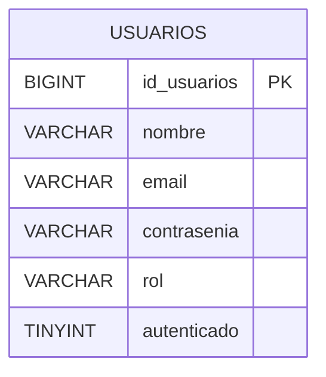

# Microservicio Users

Ecargado de la **gestión de usuarios y autenticación** dentro de la plataforma de E-Commerce.

Administra el ciclo de vida de los usuarios, desde su registro hasta la actualización o eliminación de su cuenta y proporciona tokens de autenticación mediante JWT.

---

## Responsabilidades de Users

- Registro de usuarios.
- Consulta de usuarios.
- Actualización de información.
- Eliminación de usuarios.
- Inicio de sesión.
- Autenticación.
- Asignación de un rol inicial.
- Generación de JWT para usuarios autenticados.

---

# Base de Datos

El microservicio `Users` utiliza una tabla principal:

```text
usuarios
```

Su estructura es la siguiente:

| Campo | Tipo | Descripción |
|---|---|---|
| `id_usuarios` | `BIGINT(20)` | Identificador único del usuario |
| `nombre` | `VARCHAR(100)` | Nombre del usuario |
| `email` | `VARCHAR(150)` | Correo electrónico del usuario |
| `contrasenia` | `VARCHAR(255)` | Contraseña almacenada de forma segura |
| `rol` | `VARCHAR(45)` | Rol asignado al usuario |
| `autenticado` | `TINYINT` | Indicador asociado al estado de autenticación |

---

## Diagrama de Base de Datos



---

# API REST

Se exponen los siguientes endpoints:

| Método | Endpoint | Descripción |
|---|---|---|
| `POST` | `/api/users` | Registrar un nuevo usuario |
| `GET` | `/api/users/{id}` | Consultar un usuario |
| `PUT` | `/api/users/{id}` | Actualizar información de un usuario |
| `DELETE` | `/api/users/{id}` | Eliminar/desactivar un usuario |
| `POST` | `/api/auth/login` | Autenticar usuario y generar JWT |

---